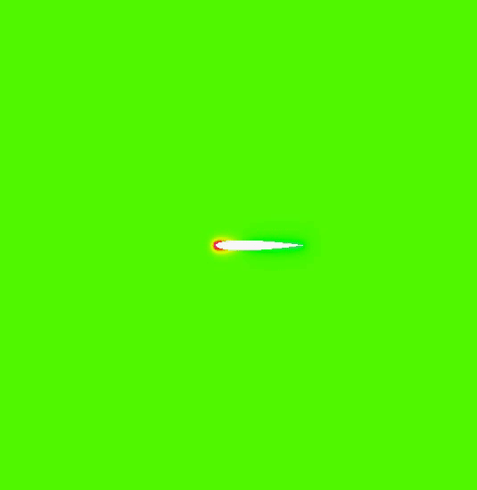

### Projects

### CAA NACA0012

Fluctuating pressure at the leading edge of a NACA0012 airfoil, ExtendedDelayed Detached Eddy Simulation of NACA0012 (Incompressible,M=0.2), stagnation point (x=0, y=0), length of the airfoil= 1

Fluctuating pressure at the leading edge of a NACA0012 airfoil, ExtendedDelayed Detached Eddy Simulation of NACA0012 (Incompressible,M=0.2), stagnation point (x=0, y=0), length of the airfoil= 1

### CAA NACA0012

Fluctuating pressure at the leading edge of a flat plate, ExtendedDelayed Detached Eddy Simulation of a Flat Plate (Incompressible,M=0.2), stagnation point (x=0, y=0), length of the plate= 1
