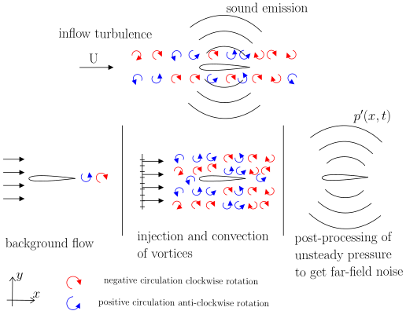
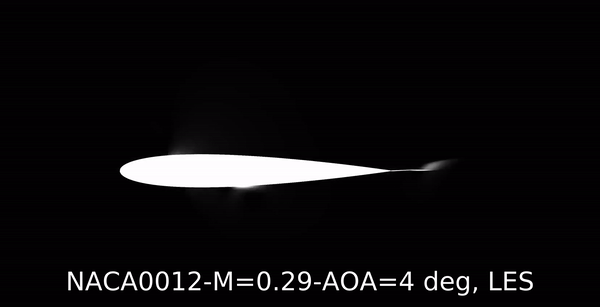

# Welcome to My Research Website  
Thank you for stopping by! I’m just a **humble turbulence wrangler** at the **German Aerospace Center (brace yourself: Deutsches Zentrum für Luft- und Raumfahrt—good luck pronouncing that without sounding like you’re in a movie)**. I specialize in turbulence and aeroacoustics, which is just a fancy way of saying I spend my time making air behave... or at least trying to.  
Feel free to check out my research group's page [here](https://www.damtp.cam.ac.uk/research/waves/) for more turbulence-related adventures! 🚀

## 🌟 Recent Publications  

### **Published in [Journal of Physics: Conference Series](https://iopscience.iop.org/article/10.1088/1742-6596/2767/2/022059)**  
  
*Figure: Dynamics of vortex injection, turbulence, and noise emission around an airfoil.*  
📄 **[Efficient Prediction of Turbulent Inflow and Leading-Edge Interaction Noise Using a Vortex Particle Method](https://iopscience.iop.org/article/10.1088/1742-6596/2767/2/022059)**  

### **Published in [Journal of Sound and Vibration](https://doi.org/10.1016/j.jsv.2023.117563)**  
  
*Figure: Contours of the normalized streamwise mean velocity.* 
📄 **[On the Influence of Porous Coating Thickness and Permeability on Passive Flow and Noise Control of Cylinders](https://doi.org/10.1016/j.jsv.2023.117563)**  

### **Published in [Physics of Fluids](https://doi.org/10.1063/5.0101270)**  
📄 **[Features of Far-Downstream Asymptotic Velocity Fluctuations in a Round Jet: A One-Dimensional Turbulence Study](https://doi.org/10.1063/5.0101270)**  

## 🎥 Featured Simulations  

### Turbulent Round Jet at Re=94000  
<iframe width="560" height="315" src="https://www.youtube.com/embed/qHuFF20aQBo?controls=0" title="YouTube video player" frameborder="0" allow="accelerometer; autoplay; clipboard-write; encrypted-media; gyroscope; picture-in-picture" allowfullscreen></iframe>  

### Large Eddy Simulations for Aeroacoustics  
  
**Fluctuating Pressure Around NACA0012 Airfoil**  

## 🔍 Research Areas  

My primary research interests focus on **Computational Fluid Dynamics (CFD)** and **Computational Aeroacoustics (CAA)**. Key areas include:  
- Vortex Dynamics & Synthetic Turbulence Modelling  
- Aeroacoustics & Vortex Sound  
- Stochastic Modeling & Monte Carlo Methods  
- Hamiltonian Dynamics & Meshless Methods  
- Parallel Computing & Evolutionary Algorithms  

## 🛠️ Code Development Projects  

### [Synthetic Vorton Turbulence Model](https://github.com/Sparsh-Sharma/Synthetic-Vorton-Turbulence-Model)  
Generating turbulent inflow using Gaussian-profile vortices.  
  

### [Vortex Particle Solver](https://github.com/Sparsh-Sharma/Lagrangian-Solver-for-Euler-Equations)  
2D Euler equations solver using a Lagrangian approach.  
  

### [Ffowcs Williams-Hawkings Acoustic Solver](https://github.com/Sparsh-Sharma/Ffowcs-Williams-Hawkings-Acoustic-analogy)  
Directivity pattern of sound pressure around an airfoil.  
  

## 📑 Publications  

For a comprehensive list of my publications, [download my CV](./CV.pdf).  
Here are a few highlights:  
- **Sharma, S.**, Geyer, T., & Sarradj, E. (2023). Numerical investigation of noise generation by rod-airfoil configuration using DES and the FW-H analogy.  
- **Sharma, S.**, & Sarradj, E. (2019). Two-dimensional isotropic turbulent inflow conditions for vortex particle method. *Physical Review Fluids*.  
- **Sharma, S.**, Geyer, T., & Schmidt, H. (2018). Detached Eddy Simulation of the Flow Noise Generation of Cylinders with Porous Cover.  

## 🎓 Doctoral Thesis  
📄 **[Stochastic Modelling of Leading-Edge Noise in Time-Domain Using Vortex Particles](https://doi.org/10.26127/BTUOpen-5085)**  

## 🔗 External Resources  

- [OpenFOAM V7](https://openfoam.org/download/7-source/)  
- [Cluster 'Euler'](https://www.cluster-euler.org/)  

## Contact  
Feel free to explore my research and reach out if you’re interested in collaborations or have questions about my work!
