## Welcome to my website

Thanks for visiting! I am currently a Research Associate at the Brandenburg Technical University and the Technical University-Berlin working in the field of aeroacoustics and turbulence. My research group's official page is [here](https://www.b-tu.de/fg-akustik/).

## Doctoral Thesis: [Stochastic modelling of leading-edge noise in time-domain using vortex particles](https://doi.org/10.26127/BTUOpen-5085)

## Code Development Projects

### [Synthetic-Vorton-Turbulence-Model](https://github.com/Sparsh-Sharma/Synthetic-Vorton-Turbulence-Model)
Turbulent inflow generation using the Gaussian shape profiles vortices

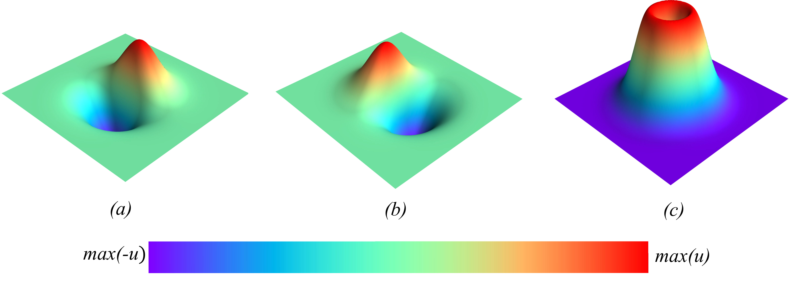

### Delayed Detached Eddy Simulation using SU2
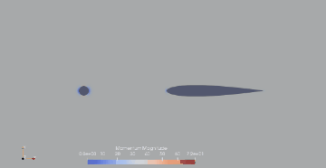

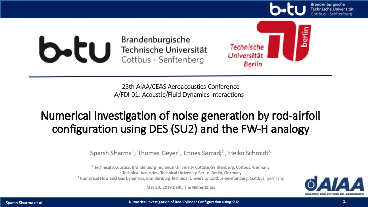

### [Vortex Particle Solver](https://github.com/Sparsh-Sharma/Lagrangian-Solver-for-Euler-Equations)
2d Euler equations solver based on the Lagrangian approach
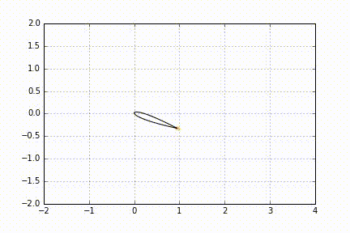

### [Ffowcs Williams - Hawkings Acoustic Solver](https://github.com/Sparsh-Sharma/Ffowcs-Williams-Hawkings-Acoustic-analogy)
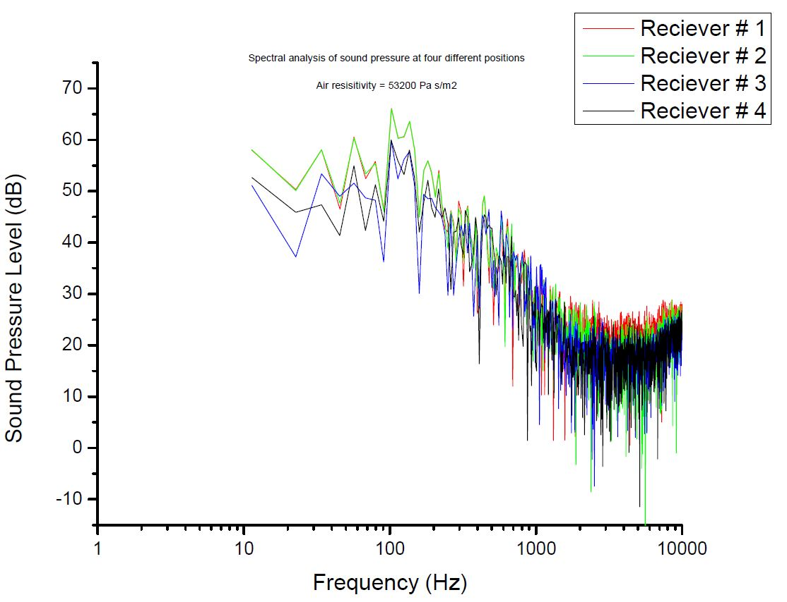
Directivity pattern of sound pressure level around a symmterical airfoil

### Stochastic Optimisation - Genetic Algorithm 
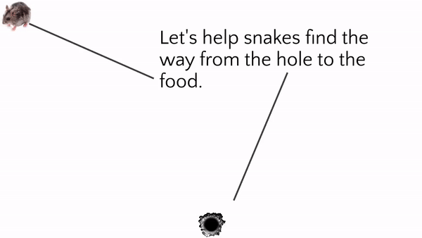
Let’s help the snakes find the way from the hole to the food

## Results
### Internoise 2018, Chicago IL
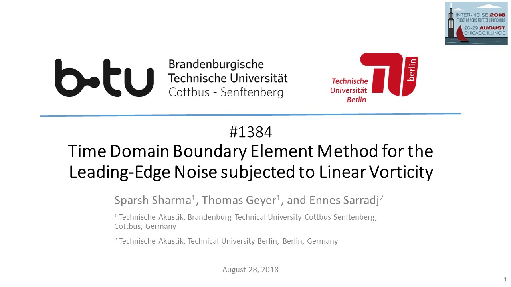

### CAA NACA0012

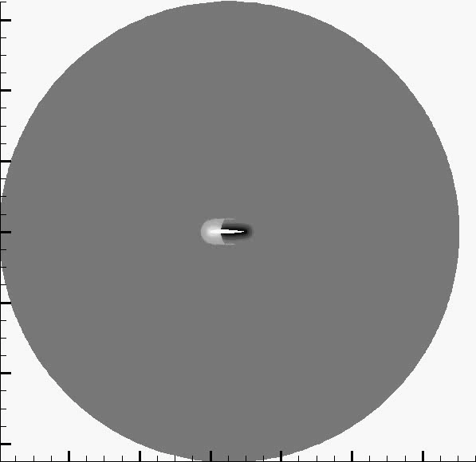
Fluctuating pressure at the leading edge of a NACA0012 airfoil, ExtendedDelayed Detached Eddy Simulation of NACA0012 (Incompressible,M=0.2), stagnation point (x=0, y=0), length of the airfoil= 1

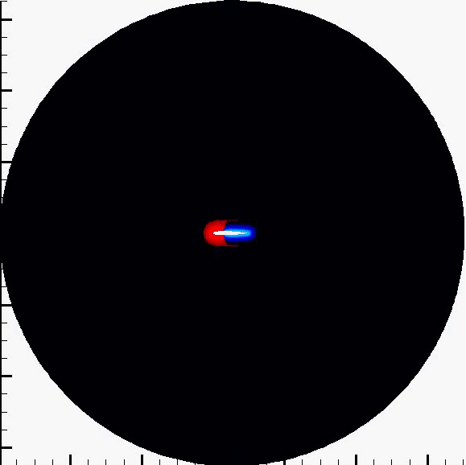
Fluctuating pressure at the leading edge of a NACA0012 airfoil, ExtendedDelayed Detached Eddy Simulation of NACA0012 (Incompressible,M=0.2), stagnation point (x=0, y=0), length of the airfoil= 1

### CAA Flate plate

Fluctuating pressure at the leading edge of a flat plate, ExtendedDelayed Detached Eddy Simulation of a Flat Plate (Incompressible,M=0.2), stagnation point (x=0, y=0), length of the plate= 1

### Detached Eddy Simulation of cylinder with a porous cover
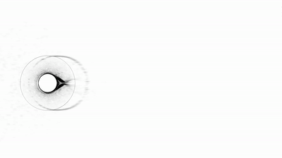

### Velocity fluctuations at the surface of a cylinder for CAA
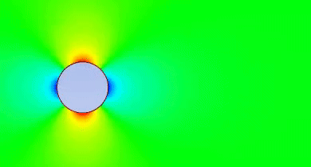

### Vorticity around a cylinder
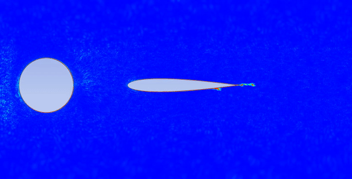

## Research

My primary area of research is Computational Fluid Dynamics (CFD) and Computational Aeroacoustics (CAA). I prefer the Lagrangian approach to solve the fluid flow equations.

- Vortex Dynamics
- Meshless Methods
- Hamiltonian Dynamics
- Synthetic Turbulence Modelling
- Aeroacoustics
- Vortex Sound
- Stochastic Modelling
- Evolutionary Algorithms
- Monte-Carlo Methods and Uncertainity Quantification
- Parallel Computing
 
## [Projects](./another-page.html)

- Stochastic Modelling of Leading-Edge Noise [(GRS)](https://www.b-tu.de/researchschool/cluster/cluster-3-stochmethod)
- High-Fidelity Simulations of flow inside the Porous Materials
- Projekt [SHEFAE2](https://ec.europa.eu/inea/en/horizon-2020/projects/h2020-transport/aviation/shefae-2) (Surface Heat Exchanger For Aero Engine 2) Rolls-Royce Deutscheland

## Publications

- S Sharma, T Geyer, E Sarradj, H Schmidt "Numerical investigation of noise generation by rod-airfoil configuration using DES (SU2) and the FW-H analogy", 2019 AIAA/CEAS Aeroacoustics Conference, Delft, The Netherlands, [(AIAA 2019)](https://arc.aiaa.org/doi/abs/10.2514/6.2019-2400)<a href="/AIAA2019_Sharma.pdf" download>Download link</a>
- Sharma, S., & Sarradj, E. (2019). Two-dimensional isotropic turbulent inflow conditions for vortex particle method. Physical Review Fluids, 4(2). [(Physical Review Fluids)](https://doi.org/10.1103/PhysRevFluids.4.022701)<a href="/PRF2019.pdf" download>Download link</a>
- T Geyer, S Sharma, E Sarradj, "Detached Eddy Simulation of the Flow Noise Generation of Cylinders with Porous Cover", 2018 AIAA/CEAS Aeroacoustics Conference, AIAA AVIATION Forum, [(AIAA 2018-3472)](https://www.google.de/url?sa=t&rct=j&q=&esrc=s&source=web&cd=1&cad=rja&uact=8&ved=2ahUKEwi_hJ22u7jcAhWGKVAKHfaSB2MQFjAAegQIABAB&url=https%3A%2F%2Farc.aiaa.org%2Fdoi%2Fabs%2F10.2514%2F6.2018-3472&usg=AOvVaw0eLhBQyFuI-UqnKwdPerLM) <a href="/Geyer2018D.pdf" download>Download link</a>
- S Sharma, E Sarradj, H Schmidt, "Low-Fidelity Stochastic Approach for Airfoil-Turbulence Interaction Noise", DAGA 2018 - 44. JAHRESTAGUNG FÜR AKUSTIK, München Germany, 1184-1187
- S Sharma, E Sarradj, H Schmidt, "Unsteady Lift due to the Interaction of Incidence Turbulence with an Airfoil", DAGA 2017 - 43. JAHRESTAGUNG FÜR AKUSTIK, Kiel, Germany
- S Sharma, K Vora, B Ashok, "CFD Modeling of Advanced Swirl Technique at Inlet-Runner for Diesel Engine", SAE Technical Paper 2015-26-0095, 2015 <a href="/SAE2015.pdf" download>Download link</a>
- G Bindal, S Sharma, F Janser, E Neu, "Detailed analysis of variables affecting wing kinematics of bat flight", SAE International Journal of Aerospace 6 (2013-01-9003), 811-818 <a href="/SAE2013.pdf" download>Download link</a>
- S Sharma, G Bindal, "Computational Analysis of 3D Unsteady Flow Over Flapping Wing", SAE Technical Paper 2013-01-2098, 2013
